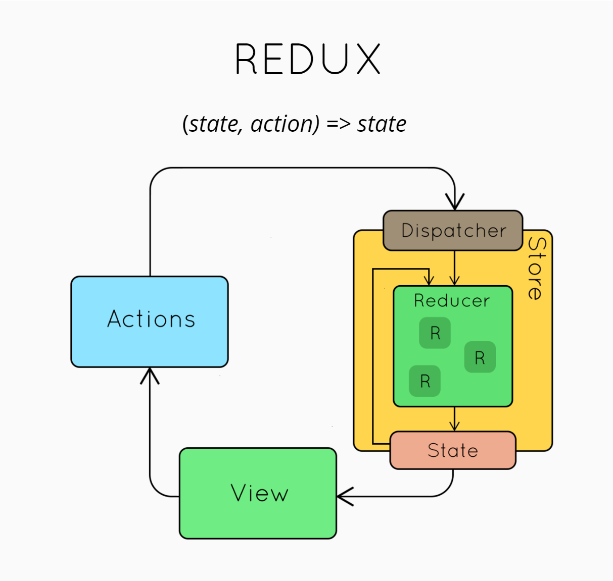

#### 记录Redux一些疑难点:
---

*   API:

    *   [mapStateToProps](#palm_treemapStateToProps)

    *   [mapDispatchToProps](#palm_treemapDispatchToProps)

    *   [Action](#palm_treeAction)

---

*   ## :palm_treemap:mapStateToProps
    ```javascript
    /*[mapStateToProps(state, [ownProps]): stateProps] 

    mapStateToProps是connect()中的第一个参数,如果定义该参数,那么其会监听mapStateToProps中定义的对象的变化,
    只要Redux store发生变化就会调用该参数,然后将Store中的state映射至组件的props.
    ownProps代表传入组件的Props,如果定义了该参数,当组件接收到新的Props时,mapStateToProps会被重新调用

    */

    const mapStateToProps = (state, ownProps) => {
    return {
            userInfo: state.userInfo,   // 监视
            isLoading: state.isLoading,
            errMessage: state.errMessage
        }
    }

    // 采用bindActionCreators

    import {bindActionCreators} from 'redux'
    const mapDispatchToProps = {} =(dispatch, ownProps) => {
    return bindActionCreators({
            dispatch1: dispatch1
        },dispatch)
    }

    // 最简单的方式
    export default connect(mapStateToProps, {dispatch1})(UserInfo);
    ```

*   ## :palm_treemap:mapDispatchToProps
    ```javascript
    /* [mapDispatchToProps(dispatch, [ownProps]): dispatchProps] 

    mapDispatchToProps作用是当你要通过一个函数来触发action时需要在mapDispatchToProps定义那个改变函数。

    ** 详细解释: 因为调用触发派发action的 "dispatch1" 函数只会返回action,并没有将其派发出去,所以需要使用dispatch将 "dispatch1" 包裹派发出去,但是为了不让组件感知到dispatch的存在,所以需要包装一下
    */

    const mapDispatchToProps = (dispatch, ownProps) => {
    return {
        dispatch1: () => {
                dispatch(dispatch1())
            }
        }
    }
    ```

*   ## :palm_treemap:connect()
    ```javascript
    /* connect([mapStateToProps], [mapDispatchToProps], [mergeProps], [options])
    
    将Redux与React连接在一起,返回一个新的(不会改变原来的组件类)与Redux store连接的组件类
    
    */
    ```

*   ## :palm_treemap:Action
    ```javascript
    /*
        1 - 解释为什么Action的类型都是常量,type都是字符串,或者至少可序列化
        2 - 解释是否存在Action跟Reducer之间的一对一的映射
        
        1 - 答:
            *   使用常量可以避免使用import导入action时避免大小写错误等低级问题
            *   序列化是因性能问题
        2 - 答:
            *   不存在,如果存在的话,那么在处理多个Reducer对一个Action的问题会非常棘手


     */ 
    ```
*   ##  :palm_treemap: dispatch()
    ```javascript
    /*
        dispatch用于将action行为作用于Reducers
    */
    ```

---
